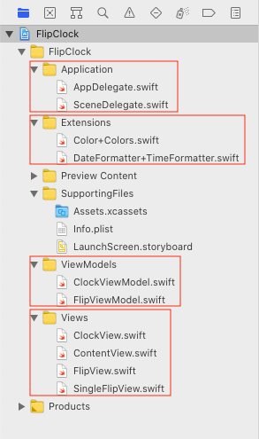
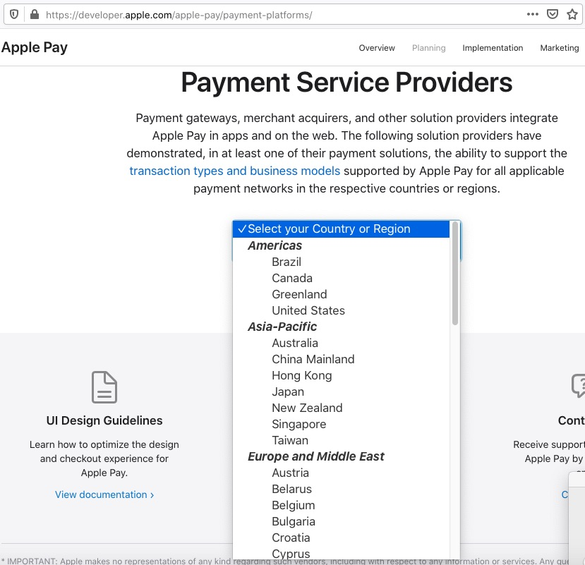

# Notes

## Additional Reference and Examples

### MVVM

1. [Flip clock implementation in SwiftUI](https://github.com/elpassion/FlipClock-SwiftUI) by [EL Passion](https://www.elpassion.com/)




### SOLID principles

1. [SOLID Principles Applied To Swift](https://marcosantadev.com/solid-principles-applied-swift/) at marcosantadev

2. [S O L I D Principle with Swift](https://medium.com/flawless-app-stories/s-o-l-i-d-principle-with-swift-b42f597ba7e2) at Flawless iOS (medium)

3. [I → Interface segregation principle (ISP) - simple example](https://stackoverflow.com/a/35382190/2641380) at stackoverflow


### Apple Pay

1. [Guide by Apple](https://developer.apple.com/library/archive/ApplePay_Guide/)

2. [List of Payment service providers](https://developer.apple.com/apple-pay/payment-platforms/)



3. [Enable Apple Pay by Square payment provider](https://developer.squareup.com/docs/in-app-payments-sdk/add-digital-wallets/apple-pay)

4. [Apple Pay Tutorial @ raywenderlich.com](https://www.raywenderlich.com/2113-apple-pay-tutorial-getting-started)

5. Article on medium.com [Working With Apple Pay](https://medium.com/@aliakhtar_16369/working-with-apple-pay-27632ee23482) by [Ali Akhtar](https://medium.com/@aliakhtar_16369)
    

### Localization

1. Example from raywenderlich.com. [SwiftUI Localization Tutorial for iOS: Getting Started](https://www.raywenderlich.com/27469286-swiftui-localization-tutorial-for-ios-getting-started)

2. From Apple Developer for Swift packages. [Localizing Package Resources](https://developer.apple.com/documentation/swift_packages/localizing_package_resources)    


### Tutorials

1. Example from hackingwithswift to create project from start. [SwiftUI tutorial: Building a complete project](https://www.hackingwithswift.com/quick-start/swiftui/swiftui-tutorial-building-a-complete-project) by [Paul Hudson](https://www.hackingwithswift.com/about)


### Libraries

1. Screen Recorder in app - Wyler - Output as a video file. It is using ReplayKit with iOS 11 SDK methods.

    * [Blog link](https://medium.com/flawless-app-stories/wyler-screen-recording-made-easy-on-ios-b6451511a715)

    * [Github link](https://github.com/toupper/Wyler)


### Stackoverflow

1. [SwiftUI - Button - How to pass a function request to parent](https://stackoverflow.com/a/59861463/2641380) - how to pass a closure to your child view which then calls a function of the parent.


### Resources

1. [The Atlasnye playing cards deck laid out, in SVG vector format. The picture card images are based on A.I.Charlemagne's original sketches (which are in the public domain themselves due to old age)](https://en.wikipedia.org/wiki/File:Atlasnye_playing_cards_deck.svg)

2. How to generate and use photos of fake people ( and others ) as per our requirements. [Artificial intelligence - fake image creation]( https://www.nytimes.com/interactive/2020/11/21/science/artificial-intelligence-fake-people-faces.html?utm_source=pocket-newtab-intl-en) 
    * Examples
        * Person - fake people face creation [https://thispersondoesnotexist.com/](https://thispersondoesnotexist.com/)
        * Cat [https://thiscatdoesnotexist.com/](https://thiscatdoesnotexist.com/)
        * Art [https://thisartworkdoesnotexist.com/](https://thisartworkdoesnotexist.com/)
        * Horse [https://thishorsedoesnotexist.com/](https://thishorsedoesnotexist.com/)
        * Chemicals [https://thischemicaldoesnotexist.com/](https://thischemicaldoesnotexist.com/)
    * Imagined by a GAN [generative adversarial network](https://en.wikipedia.org/wiki/Generative_adversarial_network)
    * how it works (youtube) - [[1](https://www.youtube.com/watch?v=u8qPvzk0AfY)], [[2](https://www.youtube.com/watch?v=dCKbRCUyop8)] and [[3](https://www.youtube.com/watch?v=SWoravHhsUU)]
    * Code for training your own [[original](https://github.com/NVlabs/stylegan2)], [[simple](https://github.com/lucidrains/stylegan2-pytorch)]

### Notes

1. We can print the view hierarchy at any time in (lldb) via 
```swift
po UIWindow.value(forKeyPath: "keyWindow.rootViewController.view.recursiveDescription")!
```
2. If we want to make a resource from package available to apps that depend on our Swift package, declare a public constant for it. For example, use the following to expose a property list file to apps that use our Swift package:
```swift
let settingsURL = Bundle.module.url(forResource: "settings", withExtension: "plist")
```


-- End --


