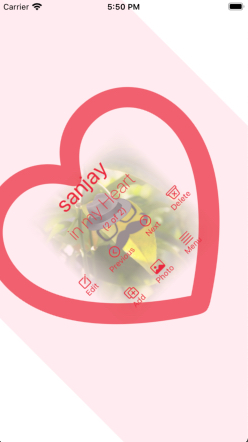
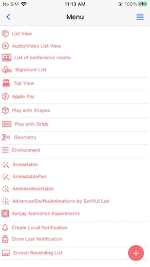
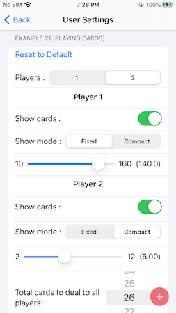
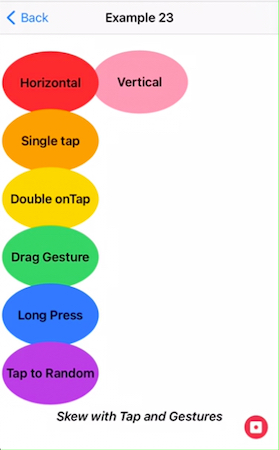
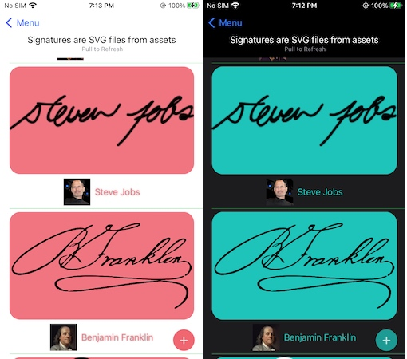

#  SanjaySwiftUI
SwiftUI project creation to learn.

## Version
1.0

### Topics learned

1. SwiftUI project.
    * @State variables
        * on modification perform some tasks with the help of Hidden Toggle control
        * on modification change another @State variable
        * the modified @State variables should not run in recursive loops.
    * controls 
        * ZStack
        * VStack with rotation effect
        
            
        
        * HStack
        * Button with padding, forgroundColor, logic in 'action', open new view with 'sheet'
        * Rectangle with rotation and scale
        * Image with aspectratio, mask of gradient, scaleEffect
            * logically load UIImage or placeholder image from systemName
            * onReceive - changes published, do some tasks.
            * loading list of filtered images in multiple HStacks on a screen in various sizes.
            * loading image from web URL with cache
        * Added displaying of views from viewArray. We can shuffle the array.
    * Multiple SwiftUI views loading from contentView
    * JSON service with Codable protocol
        * Loading and updating JSON service response. 
        * Saving json in document folder
        * Loading again the same from document folder, so no flicker on screen
        * Testing by loading jsons with multiple image urls to test loading and background saving
    * Loading UIViewControllers via UIViewControllerRepresentable in SwiftUI
        * Use Coordinator to handle delegates
        * to pass .constant as @Binding vars for SwiftUI PreviewProvider
        
            
        
    * PersonPhotoImagePickerViewController from camera and gallery via UIViewControllerRepresentable. This is creating UI with code using UIKit
    * Add custom storyboard in SwiftUI project and communication with it via UIViewControllerRepresentable
        * Use Photo Editor ( earlier version swift ). This is using UI with custom storyboard
    * ~~Custom AlertControlView via UIViewControllerRepresentable for getting 'name' text from user.~~ (not in use)
    * 'alertSS' functions to call custom alerts with textfield.
    * 'View' extension to print debug messages with PrintView method.
    * Integration / modification of Views created by 'Chris Mash' project [AVPlayer-SwiftUI](https://github.com/ChrisMash/AVPlayer-SwiftUI) for Audio/Video List View
        * List refill on shuffle array of songs.
        * Add/delete single item to core data in second audio list.
        * Added play/pause button in Audio
        * Continuing how to create proper observers of AVPlayer.
            * Issue while adding more observers.
            * 'SourceKitService" and/or 'Swift' process on mac taking max memory, so xcode and all mac proccesses slogs to halt ( macOS Catalina 10.15.6, tried on XCode 11.6 and 11.5). The issue was solved after update of XCode 11.7.
    * Added Navigation view - 'Menu' option in content view. Now back and User Settings button on navigation bar.
    
        
    
    * TabSwiftUiView added with Localizable Strings files for "ગુજરાતી" and "मराठी" display in tab. 
        * Refer: [Support multiple languages by localizing your iOS apps](https://zonneveld.dev/localize-your-ios-apps-to-support-multiple-languages/)
        * Added hardcode files LocalArabic, LocalGujarati and LocalMarathi .strings files to manually show strings in selected languages in tab
            * Added files for "عربى" to check Right to Left alignment.
                * Auto alignment as per device language settings
                * Manual Text alignment set as 'Trailing' to show in Right to Left in all ( This will be again error in Arabic language device settings, as it will make 'Left to Right' in case of Trailing setting. )
            
                
            
                * Used NLTokenizer of NaturalLanguage to tokanize words from localized 'address' string.
                    [Ref: Tokenizing Natural Language into Semantic Units in iOS](https://www.andyibanez.com/posts/tokenizing-nltokenizer/)
            * How to localize Label text in "LaunchScreen.storyboard"
                * Refer: [Comment on developer.apple.com forums](https://developer.apple.com/forums/thread/86567?answerId=632317022#632317022)
                * [Still could not see text in Arabic in LaunchScreen](https://feedbackassistant.apple.com/feedback/8714792)
    * Apple Pay test integration
        * Buy with various Landmark items. 
            * Saving Landmark data in document folder after buying, to store status of 'bought' 
            * Loading the landmark json from document folder if available ( or from bundle )
            * 'Clear all Bought data'
                * Local JSON file deleted.
                * When reloading the landmark data with load() method, view promptly refreshed 'bought' text.
        * Set different shipping options with shipping charges
            * EBook category with email shippingContactFields only
            * PaymentSummaryItem 'Shipping' charges for Lakes
            * 0 amount product without shipping charges.
        * Default alerts for test.
    * Set landmark item as 'bought' 
        * used filteredLandMark and 'firstIndex' to find the index of record, to modify it.
        * It is always better to pass id's of struct array (insted of object). We can get index of it to modify the record.
    
2. Animation test ( links added in 'Menuview' )
    * Basic animation examples 
    * AdvancedSwiftuiAnimations by [SwiftUI Lab](https://swiftui-lab.com/swiftui-animations-part1/)
    * SanjaySwiftuiAnimatuions for my experiments
        * Example 21 to show player wise cards.
        
            
        
        * User Settings options to change view options for above view. user Settings view is changed to presentable view, which cane be opened from multiple places.
        
            
            
        * Example 22 Card game of War 
        * Exmaple 23 Skew effect with Tap and Gestures
            * SSOffsetData - custom data struct conforming to VectorArithmetic
            * SkewedOffsetToAnySide GeometryEffect created using CGAffineTransform
            
            
        
   
3. Play with Shapes
    * Effects with CGAffineTransform
    * Gradient Rectangles
    
4. Play with Grids
    * Honeycomb Grid
    
        
    
        * modified example [Using memoization to speed up slow functions](https://www.hackingwithswift.com/plus/high-performance-apps/using-memoization-to-speed-up-slow-functions)
    * Resizable Grid 
    
5. Geometry and Enviornment ( Edit functionality pending ) 
    
6. GIT integration (Github)
    * Added Project to GIT from XCode 11
    * Creation and Commit to master branch from XCode
    
7. Build project from Github with [Bitrise](https://www.bitrise.io/) in cloud. ( concept is still not clear )

8. Coredata
    * usage of .xcdatamodeld
    * generation of coredataproperties and coredataclass with Editor -> Create NSManagedObject SubClass
    * @FetchRequest of entity
    * saveContext

9. Markdown format for README.md

10. Use of SF Symbols for **systemImage** icons.
    * [System Icons](https://developer.apple.com/design/human-interface-guidelines/ios/icons-and-images/system-icons/) (iOS12  and Earlier)
    * There are over 1,500 symbols text that can be used in apps running in iOS 13 and later. To browse the full set of symbols, download [the SF Symbols mac app](https://developer.apple.com/design/downloads/SF-Symbols.dmg). 
    
11. RoomList - Listing of conference rooms example by Apple. 
    * List add sample room, delete list item
    * Room detail view
        * Map view with 'eat' annotations.
    
12. Implementing SpriteKit with SwiftUI
    * Demo SpriteKit - Scene and Particle effect  (SpriteKitResources)  

        
        
13. MultiSelector picker
    * [developed by Cihat Gündüz (Jeehut)](https://dev.to/jeehut/multi-selector-in-swiftui-5heg)
    * Implementing in 'List View' to display user selected views
    
14. RecordFloatingMenuView - floating menu button to record video of the screen in mp4 file, in decoument folder. (ReplayKit)
    * This button can be moved to any of four corners before starting of recording.
    * This feature does not work for app in Simulator, but works on actual devices.
    * Issues - does not create proper mpeg file when we change the view or popup appears, while recording.
    * 'Screen Recording List' - Show list of these recording files with mpeg file thumbnail. 
        * On click open the mpeg file to play it.
        
15. SignatureListView - Usage of .svg files from assets (with photos and weblink to wikipedia.org)

    

    * Work-In-Progress - Will develop a puzzle game to match Name with Signatures and Photos.
    
16. Changed from AppDelegate and SceneDelegate to App protocol introduced in XCode 12.

17. PushNotifications :
    * MenuView - Create and present Local Notification after 10 seconds, add to coredata, show Notification List with Last Received Notification.
    * Remote Notification error when calling 'UIApplication.shared.registerForRemoteNotifications()'
        * Failed to register for notifications: no valid “aps-environment” entitlement string found for application
            * To resolve add "Push Notifications" capability at - Project Settings - targets - Signing and Capabilities.

* Important Note :-
    1. When SwiftUI does not have many views in a screen, the loading of App is faster. ( SwiftUI only loads views when they are seen on screen )
        * we should create small and multiple views in a screen, each view with single responsibility ( **S**OLID )
        * Each app screen should not be cluttered with many functionalities. 
        * The visibility of options and data should be easy to see for users. 
    
Note :-    
(1) Replace 'PrivateCommit' with 'PublicCommit' to run. 
(2) Images of face belongs to their respective copyrights.
(3) Images of RoomList by [Jan Zavrel](http://www.zavrel.net/swiftui-rooms-resources)
(4) Signature images and respective photo images and weblinks are used from Wikimedia Commons - commons.wikimedia.org and Wikipedia - www.wikipedia.org

